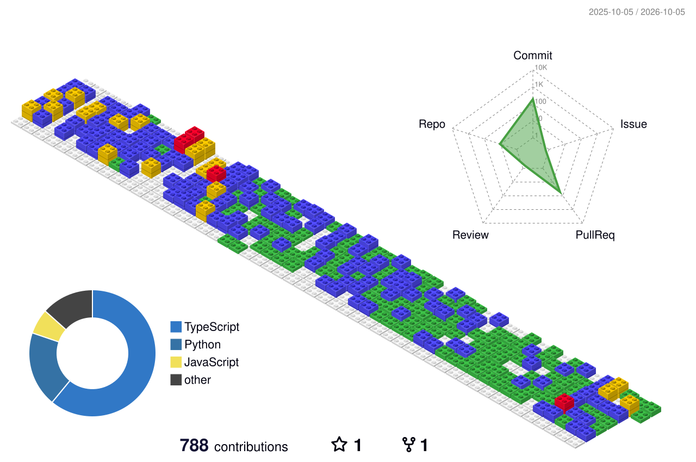

<div align="center">


<a href="https://www.shakyanikhil18.com.np/">
  
</a>

<br/>

<a href="https://www.shakyanikhil18.com.np/"></a>
<a href="https://www.linkedin.com/in/nikhil-shakya-00250b290/"></a>
<a href="mailto:shakyanikhil2003@gmail.com"></a>


</div>

<br/>

## 👨‍💻 &nbsp;About Me

```ts
const nikhil = {
  role: "Quality Assurance Analyst",
  focus: ["Test Automation", "API Testing", "Database Testing", "CI/CD"],
  currentlyLearning: ["Scalable frameworks", "Modern QA practices"],
  motto: "Quality isn't an act, it's a habit.",
};
```

I build **reliable, maintainable, and automated** testing solutions, turning manual test scenarios into automated workflows and continuously raising software quality.

<br/>

## 🧰 &nbsp;Tech Arsenal

<div align="center">

| 🧪 Automation | 🔌 API | 🗄️ Database | ⚙️ CI/CD & Tools | 💻 Dev |
|:---:|:---:|:---:|:---:|:---:|
|  |  |  |  |  |


</div>

<br/>


🚀 What I'm Currently Working On
```
🧪 Web Automation
   └── Playwright + TypeScript
   └── Page Object Model
   └── Test Data Management
   └── Cross-browser Testing

🔌 API Testing
   └── Postman
   └── Newman
   └── API Assertions
   └── CI Integration

🗄️ Database Testing
   └── SQL
   └── MySQL
   └── SQLite
   └── Data Validation

⚙️ CI/CD
   └── GitHub Actions
   └── Automated Test Execution
   └── Test Reports & Artifacts
```

## 📂 &nbsp;Featured QA Projects

| Project | Description | Stack |
|:--|:--|:--|
| 🎭 **Playwright Automation** | End-to-end testing with maintainable practices like Page Object Model | `Playwright` `TypeScript` |
| 🔌 **API Testing** | Assertions and response validation, run automatically through GitHub Actions | `Postman` `Newman` |
| ⚙️ **QA CI/CD Pipelines** | Workflows that execute tests and publish reports as CI artifacts | `GitHub Actions` |

<br/>

## 📊 &nbsp;GitHub Stats

<div align="center">


</div>


<br/>
<div align="center">
  
</div>

<br/>

## 🐍 &nbsp;Contribution Snake

<p align="center">
  <picture>
    <source media="(prefers-color-scheme: dark)" srcset="https://github.com/nikhilShakya7/nikhilShakya7/blob/output/github-snake-dark.svg">
    <source media="(prefers-color-scheme: light)" srcset="https://github.com/nikhilShakya7/nikhilShakya7/blob/output/github-snake.svg">
    
  </picture>
</p>

<div align="center">

<i>"Quality isn't an act, it's a habit."</i>

⭐ If you find my projects useful, consider giving them a star!


</div>
